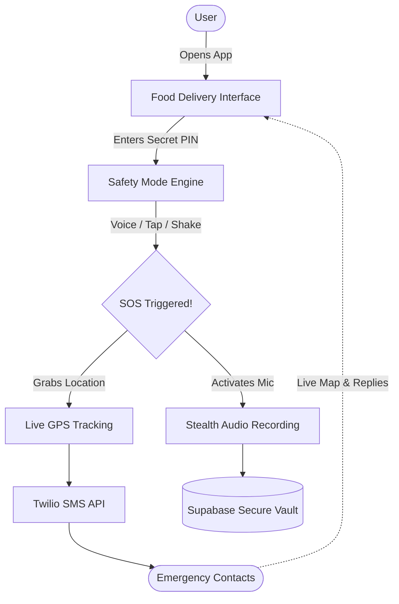

# 🚨 Zwiggy: The Personal Safety App


**The Problem:** Traditional safety apps fail because they are obvious. If you are in danger, opening a bright red SOS app can provoke an attacker, and phones are often checked or snatched away. 

**The Solution:** Zwiggy hides in plain sight. On the surface, it looks and functions exactly like a normal food delivery app. But behind a secret PIN, it transforms into a powerful, invisible bodyguard.

---

## 💡 How It Works

1. **The Disguise**: When opened normally, it looks and acts exactly like a food delivery app.
2. **Safety Mode**: Entering the secret PIN (`5678`) on the login screen unlocks the hidden safety features.

**Once unlocked, you can trigger an SOS in 3 ways:**
- 🗣️ **Voice Command**: Say *"help me"* or *"bachao"* to trigger it hands-free.
- 📱 **Triple-Tap**: Tap the Zwiggy logo 3 times.
- 📳 **Shake-to-Escape**: Shake the phone hard to instantly cancel and return to the food menu.

---

## 📐 Architecture Flow



---

## 🛠️ Tech Stack

<div align="left">
  
  
  
  
  <br/><br/>
  
  
  
</div>

---

## 🚀 Getting Started

```bash
# Install dependencies
npm install

# Start the app locally
npm run dev
```

> **Note**: You must add your Supabase and Twilio keys in a `.env` file for the SOS features to work.
